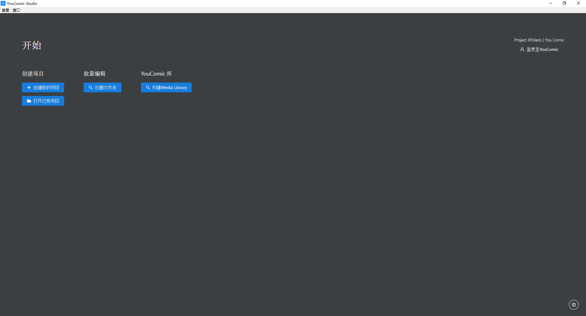
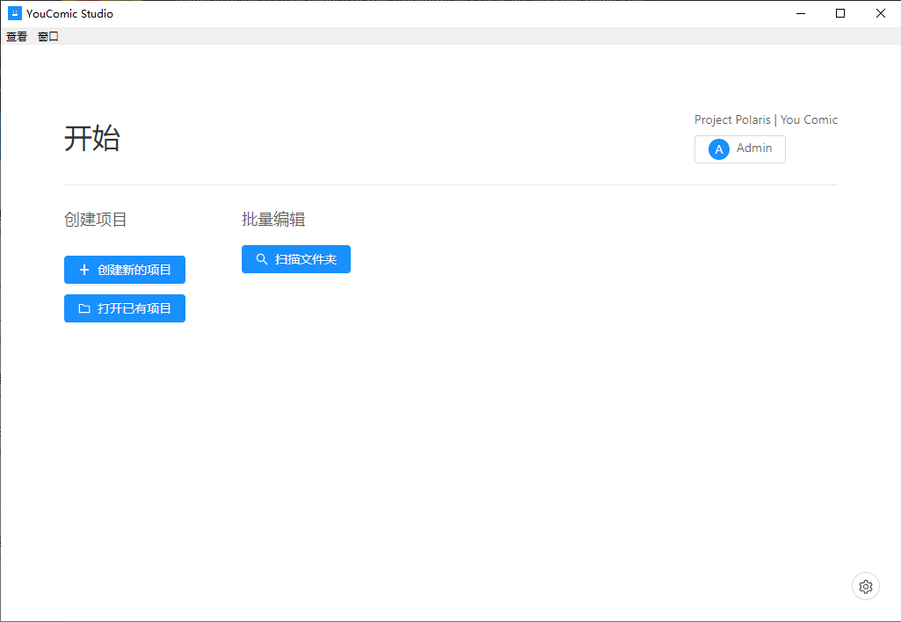

    Project Polaris | You Comic

    Project Polaris 是针对NAS内容管理的开发项目，YouComic是其中的关于漫画内容管理的套件

 

 

## YouComic Studio
 
 
 

该软件是针对YouComic开发的桌面端套件，旨在给用户提供提方便的工具处理漫画并将其上传至YouComic服务.

### ⚡功能
- 📝编辑书籍信息，标题，作者等信息
- 📁自动导入书籍信息，一键导入页面、封面，自动识别信息
- 🔖添加书籍标签
- 📤一键上传至YouComic

### 💻支持平台
- Windows
- macOS
- Linux

### 📷预览

### 🔗链接
- [☁️YouComic服务端](https://github.com/Project-XPolaris/YouComic-Server)
- [⭐️Project Polaris](https://github.com/Project-XPolaris)

